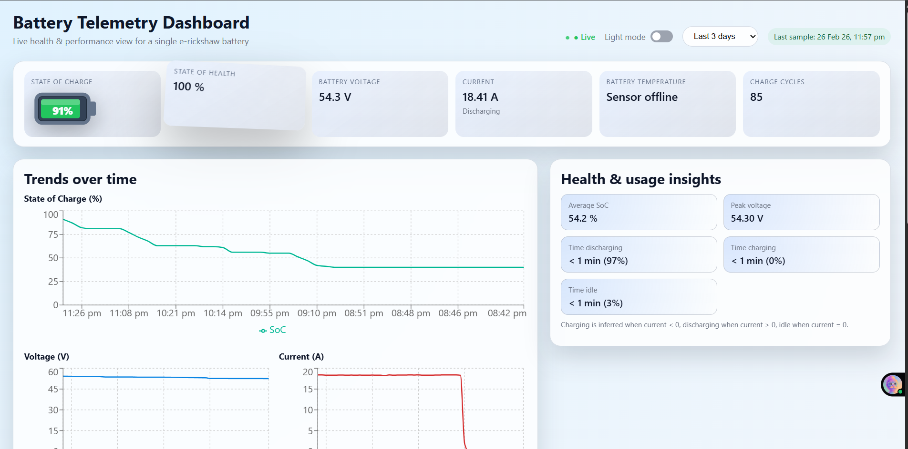
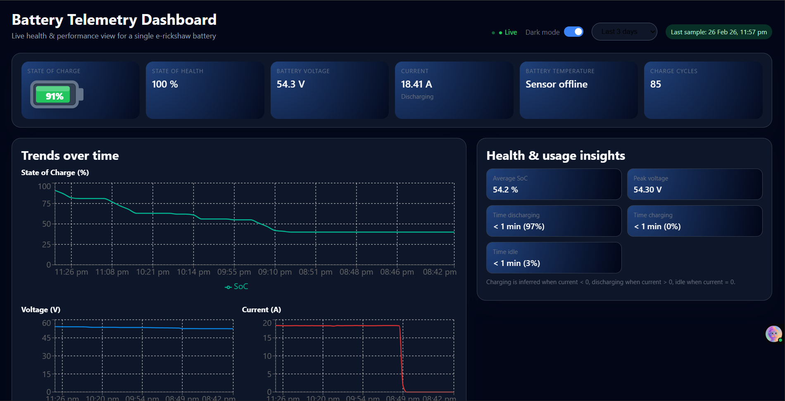
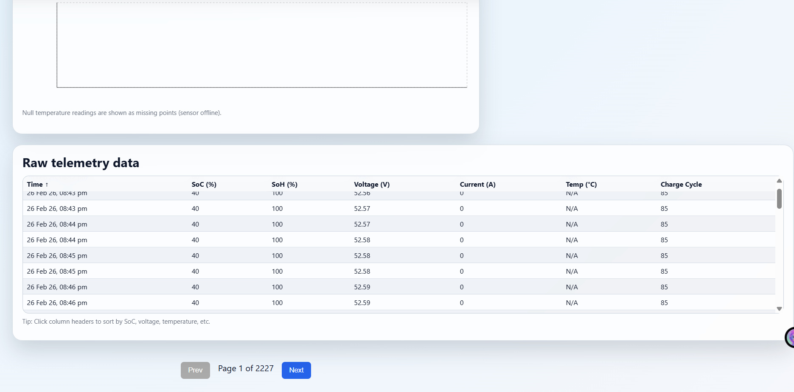

# Build and Deploy a Explore | React, MongoDB, Express.js, Node.js...


# Battery Telemetry Dashboard

Modern React dashboard for real-time visualization of lithium-ion battery telemetry data from e-rickshaws.

Designed for dealers, fleet operators and service teams to quickly understand battery health, performance trends and usage patterns.

https://github.com/your-username/battery-telemetry-dashboard

## ✨ Features

- Live status overview with animated SoC indicator  
- Visual alerts for critical conditions (SoC < 20%, Temperature > 45 °C)  
- Four interactive trend charts  
  - State of Charge (%)  
  - Battery Voltage (V)  
  - Current (A)  
  - Temperature (°C) – handles null values gracefully  
- Smart insights panel  
  - Average SoC  
  - Peak voltage  
  - Time spent charging / discharging / idle (with percentages)  
- Fully sortable & paginated raw telemetry table  
- Time range selector (last 1 / 3 / 7 / 30 days)  
- Dark / Light mode toggle  
- Responsive layout (mobile-first)  
- Loading states, error handling & last-update timestamp

## Screenshots

<div align="center">
  <table>
    <tr>
      <td></td>
      <td></td>
    </tr>
    <tr>
      <td></td>
      <td></td>
    </tr>
  </table>
</div>

## Tech Stack

**Frontend**  
• React 18 + Vite  
• Recharts  
• Axios  
• Pure CSS (glassmorphism + 3D hover effects)

**Backend** (required)  
• Node.js + Express  
• MongoDB + Mongoose  
• REST API with pagination & days filter

## Project Structure
```
battery-telemetry-dashboard/
├── backend/
│   ├── data/
│   │   └── battery_telemetry.json
│   ├── models/
│   │   └── Telemetry.js
│   ├── .env
│   ├── db.js
│   ├── index.js
│   ├── seed.js
│   └── package.json
│
├── frontend/
│   ├── public/
│   ├── src/
│   │   ├── components/
│   │   │   ├── DataTable.jsx
│   │   │   ├── InsightsPanel.jsx
│   │   │   ├── StatusCards.jsx
│   │   │   └── TimeSeriesCharts.jsx
│   │   ├── App.jsx
│   │   ├── App.css
│   │   ├── index.css
│   │   └── main.jsx
│   ├── package.json
│   └── vite.config.js (optional)
│
├── screenshots/
│   ├── dashboard-light.png
│   ├── dashboard-dark.png
│   ├── low-soc-warning.png
│   └── mobile-view.png
│
├── .gitignore
└── README.md
```

## Quick Start

### Prerequisites

- Node.js ≥ 18  
- MongoDB (local or Atlas)

### Backend

```bash
cd backend
npm install
npm run seed          # imports battery_telemetry.json (run once)
npm start             # → http://localhost:4000
```
### Frontend
```bash
cd frontend
npm install
npm run dev           # → usually http://localhost:5173
```
